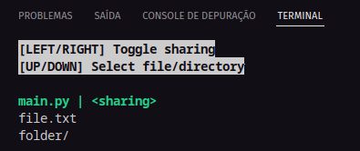
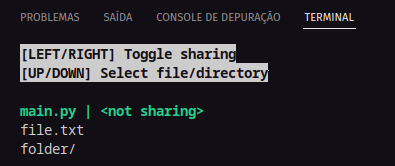

# FileShare
Um script simples minimalista que apresenta um menu, que pode controlar o compartilhamento de arquivos (presentes na pasta)
Ainda não está compartilhando de verdade, eu pretendo adicionar essa funcionalidade mais tarde (usando FTP)

  
  

